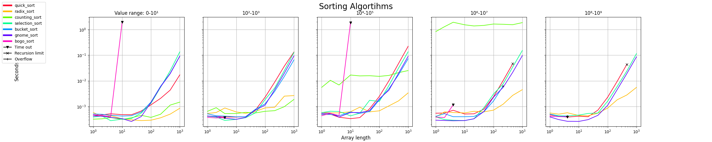
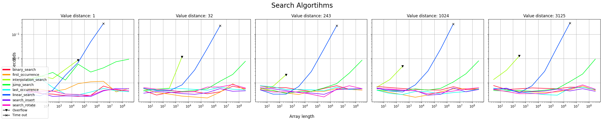

# Monitoring Non-functional properties

A rendező és kereső algoritmusok futási idejét szerrettük volna megmérni, ehhez perfomance teszteket készítettünk. A végeredményeket pedig diagramokon ábrázoltuk. A diagrammok előállítását és a tesztek futtatását aa rendeyő, valamint kereső algoritmusokra külön-külön python scriptekben vlósítottuk meg.

A teszt megírásához alábbi python könytárakat használtuk fel: 
- timeit
- numpy
- matplotlib
  
## Rendező algoritmusok

### Tesztelt algoritmusok:
- radix_sort
- counting_sort
- selection_sort
- bubble_sort
- max_heap_sort
- bucket_sort
- gnome_sort
- bogo_sort

### A futtatás eredménye

### Értékelés
A különböző sorting algoritmusok futási sebessége általában két fontos hiperparamétertől függ. Ezek a rendezendő tömb elemszáma, valamint, a mi esetünkben legalábbis, a rendezendő számok mérete. A mérettartományokra vonatkozó teszteredményeket külön grafikonokon ábrázoltuk.

#### Első ránézésre is megállapítható, hogy a rendező algoritmusokat 3 kategóriába érdemes sorolni futási sebességük elemszámmal való korrelációja alapján.
Ezek az általában stabilan viselkedő, O(n²) legrosszabb futási sebeséget produkáló algoritmusok.
- max heap
- selection
- bubble
- gnome

Találhatóak még használatra nem javasolt, instabilan, vagy egyáltalán nem működő, esetleg nevetségesen lassú algoritmusok.
- bogo 
- quick
- bucket

Maradtak az igazán gyors, O(n*log n)-es algoritmusok.
- radix
- counting

#### Érdemes kiemelni egyes algoritmusok a rendezendő szémok méretének növelésével tapasztalt viselkedését.

- counting: Míg kis számokra a radix sort algoritmussal egyenértékű, nagyobb számokat más egyáltalán nem képes kezelni.
- quick: nagyobb számok esetén elújön egy rekurziós mélységből adódó limitáció, bár ez erősen implementáció függő.
- bucket: ebben az implementációjában túlcsordulást generál.

### Megjegyzés

A tesztek kiértékeléséhez egész számokból álló véletlen tömböt generáltunk, ismétlődő elemekkel

## Kereső algoritmusok

### Tesztelt algoritmusok:
- binary_search
- first_occurrence
- interpolation_search
- jump_search
- last_occurrence
- linear_search
- search_insert
- search_rotate

### A futtatás eredménye

### Értékelés
A kereső algoritmusok futási sebessége is két hiperparamétertől függött. Ezek a tömb elemszáma és a tömbben található szomszédos számok különbsége. A lépésközökre vonatkozó teszteredményeket külön grafikonokon ábrázoltuk.

- linear search

Naiv algoritmus, ez a leglassabb viszont tetszőleges tömbbre működik. Sebessége O(n).

- jump search

Igaz, lényegesen gyorsabb mint a linear, de nagyobb elemszámoknál ez is O(n)-es.

- interpolation search

Sebessége erősen függ a lépésköztől és implementációja tólcsordulást generál.

- az összes többi

Többnyire szépen viselkedő O(n*log n)-es algoritmusok. Ehhez viszont előre rendezett tömbböt várnak bemenetként.

### Megjegyzés

A tesztek kiértékeléséhez egész számokból álló növekvő sörrendbe rendezett, egyenletes elosztású, egyedi számokat tartalmazó tömböket használtunk.

