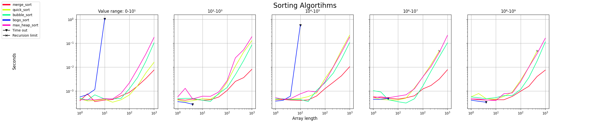
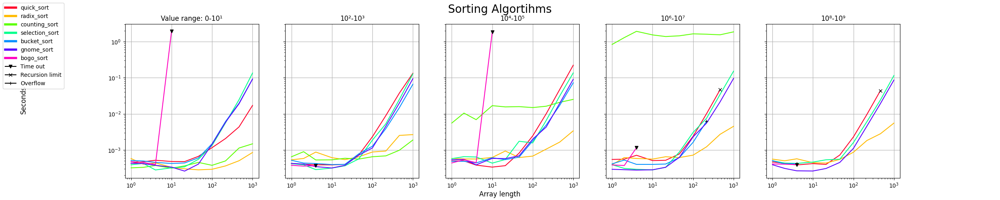
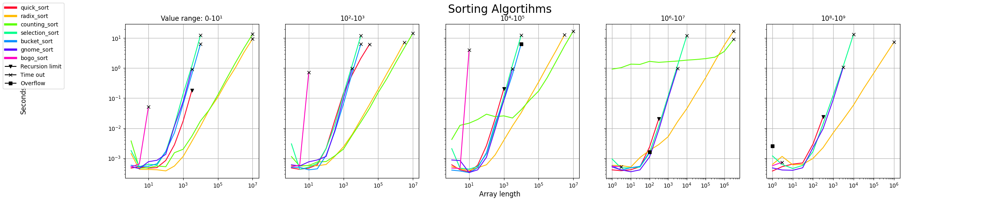
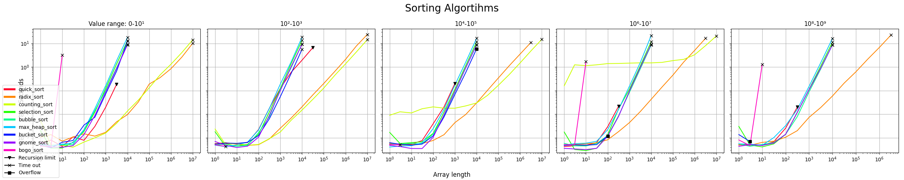

# Monitoring Non-functional properties

A rendező és kereső algoritmusok futási idejét szerrettük volna megmérni, ehhez perfomance teszteket készítettünk. A végeredményeket pedig diagramon ábrázoltuk.

A teszt megírásához alábbi python könytárakat használtuk fel: 
- timeit
- numpy
- matplotlib
  
##Rendező

Az elkészült tesztet több rendező algoritmusra is lefuttatuk.

Ezek a következők:
- radix_sort
- counting_sort
- selection_sort
- bubble_sort
- max_heap_sort
- bucket_sort
- gnome_sort
- bogo_sort

## A teszt futások erdményei

